<h1 align="center">Kumar Abhishek</h1>

<p align="center">
  Full-stack engineer shipping <b>Next.js products</b> and <b>AI voice agents</b> for US clients,<br/>
  building <b>self-hosted Rust & Go tools</b> on the side.
</p>

<p align="center">
  <b>Open to remote contract and part-time work.</b> See my work at <a href="https://krabhi4.in">krabhi4.in</a> or email <a href="mailto:kabhi87654@gmail.com">kabhi87654@gmail.com</a>.
</p>

<p align="center">
  <a href="https://krabhi4.in"></a>
  <a href="mailto:kabhi87654@gmail.com"></a>
  <a href="https://github.com/krabhi4?tab=packages"></a>
  
</p>

---

### About

```yaml
name:     Kumar Abhishek
role:     Software Engineer @ Xamtac Consulting (remote, since 2023)
location: Patna, India · remote-only · IST, overlaps US mornings
focus:    Next.js / TypeScript · AI voice agents · LLM apps with guardrails
ships:    AI calling platforms · marketplaces · payments · multi-tenant SaaS
side:     Rust + Go self-hosted tools · multi-arch Docker
track:    2,000+ commits across 40+ client projects
```

---

### Tech

**Web (production)**


**Systems & side projects**


---

### AI products

<table>
<tr>
<td width="50%">

**[VoiceDesk](https://github.com/krabhi4/voicedesk)** &nbsp; <sub>ElevenLabs · WebRTC · Postgres</sub><br/>
AI phone receptionist you can call from the browser. Books, reschedules and cancels real appointments, and the database refuses double bookings even when the agent gets it wrong.

</td>
<td width="50%">

**[AfterCall](https://github.com/krabhi4/aftercall)** &nbsp; <sub>LLM · Zod · Next.js</sub><br/>
Sales-call transcript in, CRM data out: lead score, action items, pipeline move. The model proposes; code validates the schema and only allows legal stage transitions.

</td>
</tr>
</table>

### Self-hosted tools

12 multi-arch Docker images on `ghcr.io/krabhi4/*` · ~1,290 combined pulls.

<table>
<tr>
<td width="50%">

**[dload](https://github.com/users/krabhi4/packages/container/package/dload)** &nbsp; <sub>Rust · Axum · librqbit · `ghcr.io`</sub><br/>
Memory-efficient HTTP + BitTorrent download manager. Streams chunks to disk — runs in **20–50 MB RAM** vs aria2's 100–500 MB. REST API + web UI.

</td>
<td width="50%">

**[rime](https://github.com/krabhi4/rime)** &nbsp; <sub>Go</sub><br/>
Context-aware homelab dashboard. Rewrites every service URL based on `window.location.hostname` — one deployment serves LAN, mesh-VPN, and reverse-proxy contexts.

</td>
</tr>
<tr>
<td width="50%">

**[tunewright](https://github.com/krabhi4/tunewright)** &nbsp; <sub>Rust · `ghcr.io`</sub><br/>
Self-hosted Mp3tag-style web app. Batch-edits MP3/FLAC/M4A/OGG/WAV tags with MusicBrainz lookup, cover art, virtualized grid. Single container, no DB.

</td>
<td width="50%">

**[gluetun-connector](https://github.com/krabhi4/gluetun-connector)** &nbsp; <sub>Rust</sub><br/>
VPN-tunnel monitor daemon with auto-recovery. Multi-arch image auto-published via GitHub Actions.

</td>
</tr>
<tr>
<td width="50%">

**[cli-player](https://github.com/krabhi4/cli-player)** &nbsp; <sub>Rust</sub><br/>
Terminal music player, packaged for Debian via `cargo-deb`.

</td>
<td width="50%">

**[byte-meter](https://github.com/krabhi4/byte-meter)** &nbsp; <sub>Next.js · TS</sub><br/>
Bandwidth/storage unit converter. RSC, accessibility-first ARIA + semantic HTML.

</td>
</tr>
</table>

---

### By the numbers

<table>
<tr>
<td align="center"><b>~1,290</b><br/><sub>Docker pulls<br/>across GHCR</sub></td>
<td align="center"><b>12</b><br/><sub>multi-arch<br/>containers</sub></td>
<td align="center"><b>3+ yrs</b><br/><sub>remote<br/>full-stack</sub></td>
<td align="center"><b>40+</b><br/><sub>client<br/>projects</sub></td>
</tr>
</table>

### Stats

<p align="center">
  
  
</p>

---

<p align="center">
  <sub>Hiring or need a contractor? See <a href="https://krabhi4.in">krabhi4.in</a> or email <a href="mailto:kabhi87654@gmail.com">kabhi87654@gmail.com</a>.</sub>
</p>
